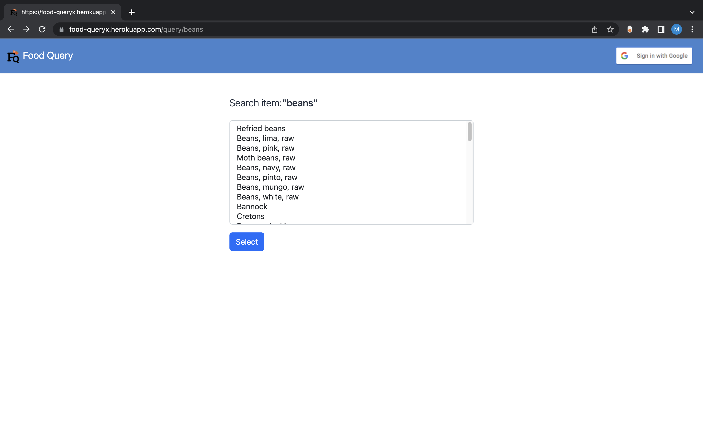
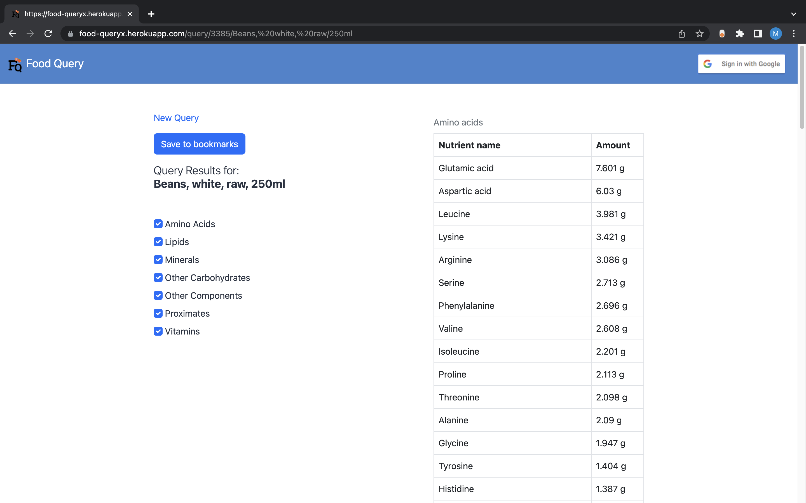
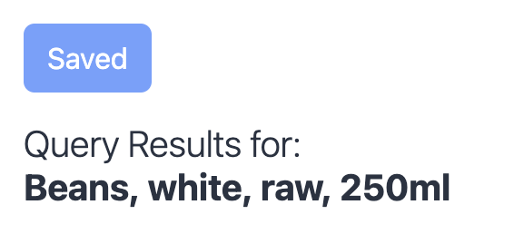
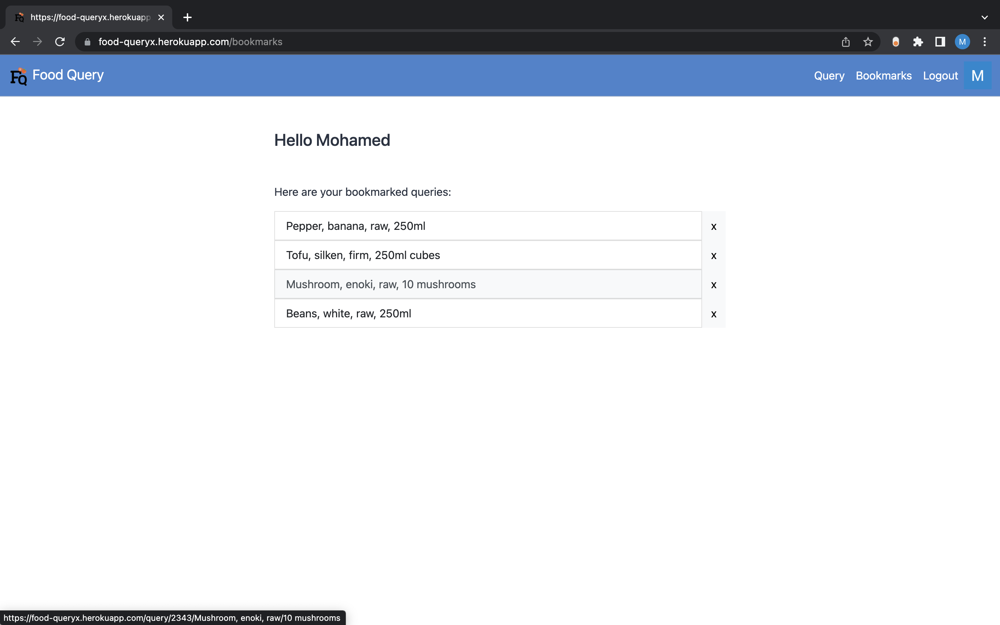

# FoodQuery

A querying app built with FastAPI that fetches all nutrient data of selected food items from the
2015 Canadian Nutrient File. You can also save query results for faster lookups using your Google login.
 
[FoodQuery app](https://food-queryx.herokuapp.com/query)

## How to use 

### Step 1:
Proceed through the querying process by selecting the desired food item and serving size.

### Step 2:
Analyze the query output and feel free to toggle the nutrient checkboxes to only display 
the tables of interest. 

### Step 4:
Save your query result using your Google login.

### Step 5:
Go back to your saved queries for faster lookups!

